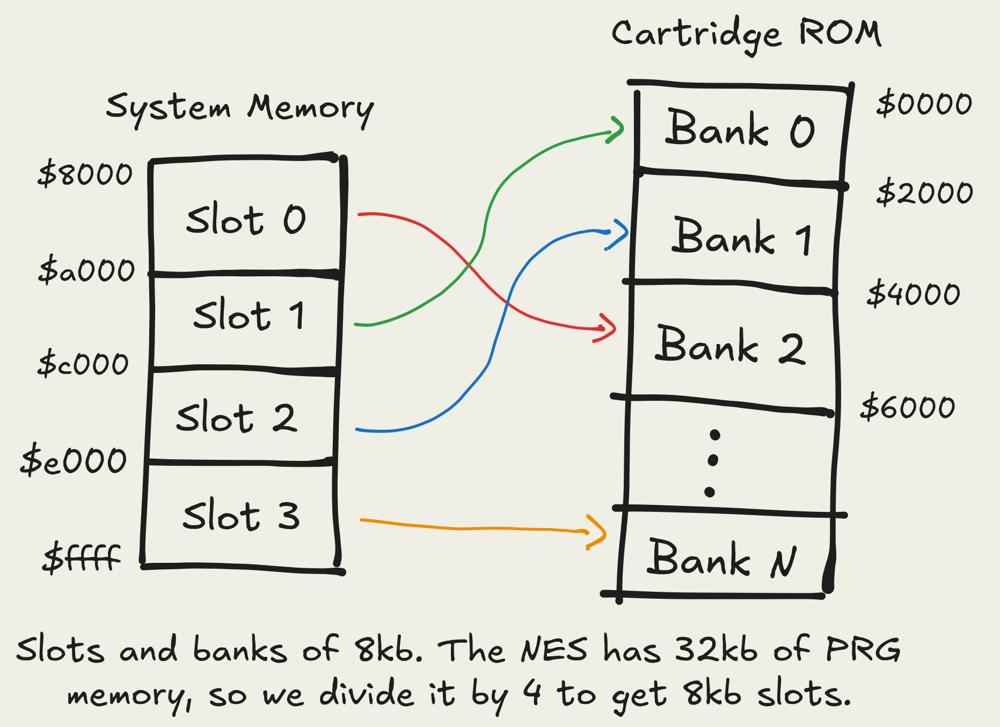

+++
date = '2025-02-10T22:29:48+01:00'
modified = '2025-02-16T18:00:00+01:00'
draft = false
description = 'Banking'
linkTitle = 'Banking system for NES/Gameboy emulators'
title = 'A bulletproof banking system for NES/Gameboy emulators'
summary = 'Short guide on how to implement a convenient and powerful memory banking system for emulators.'
author = 'Comba92'
tags = ['nes', 'gameboy', 'emulation', 'coding', 'rust']
keywords = ['nes', 'emulator', 'emulation', 'coding', 'programming', 'banks', 'memory', 'memory banking', 'memory banks', 'development', 'devlog', 'resource', 'banking', 'gameboy', 'implementation', 'rust']
aliases = ['/page/posts/banking']
+++
Peeking at nesdev's wiki page about [mappers](https://www.nesdev.org/wiki/Mapper), can be daunting, knowing you will have to implement dozens of those to get more games working. Most people will either implement a few and call it a day with their NES emulation, and don't even bother trying with the hardest one.
. You can clearly see the the PRG chip (left), CHR chip (right), and the mapper (bottom). The small chip on the right is [Nintendo's CIC](https://en.wikipedia.org/wiki/CIC_(Nintendo)), the lockout chip to prevent piracy. [Image Source](https://nesdoug.com/2019/11/11/23-advanced-mapper-mmc3/) ")
<br>
It is true that to get most games running, you only need to implement the first 5 Nintendo mappers (NROM, MMC1, UxROM, CNROM, MMC3). Even if they only are 5, we have a lot of duplicate functionality. And banking can be a little tricky, as there is a bit of math involved with it. Whenever you are involved with math in code, you definetely want to abstract it out as soon as possible, so you don't have to deal with it again later. This is what I call "nasty code"™️.

For the Gameboy, banking works exactly the same as the NES, so we can use the same mechanism for both systems.

Mappers mostly have to do the same things:
- Handle their registers writes to the PRG-ROM address range;
- Access to banked PRG/CHR addresses;
- Nametables mirroring (it is the same concept as PRG/CHR banking!)
- Other custom (and usually rare) functionality.

We surely do not want to implement each mapper logic from scratch. With this in mind, we can ease our mappers development with some good old abstraction.

## The Mapper interface
First, all mappers should provide a generic interface to work with them. They should store a banking object, which holds all the current game bankings configuration (PRG-ROM, CHR, PRG-RAM, and Nametables VRAM, yes, we also hold the PPU mirroring in there!)
The idea is this:
1. When we build the mapper, we set up the bankings, and any other needed mapper state.
2. When we WRITE to the registers (PRG-ROM address range) to change banks, we update the banking configuration.
3. When we READ to the cartridge PRG-ROM, or READ/WRITE to the CHR, PRG-RAM, or Nametables VRAM, we simply translate the address given the current banking configuration.
4. For more complex mappers, on each CPU clock, we can handle IRQs, Audio expansions, and scalines detectors (we might want to add even more functions based on how we need to wire the mapper object to the rest of our emulator).


  I figured ALL mappers would need to hold the bankings object, so I have decided to move it out of the mapper object, so that i only have to define it once on the upper object owning the mapper, and then pass it to the mappers through their methods (this means less typing when defining mappers, probably).



  Rust shenanigans: as we can't know at compile which mapper to use, we are using a [trait object](https://doc.rust-lang.org/book/ch17-02-trait-objects.html), and we have to wrap it inside a [Box](https://doc.rust-lang.org/book/ch15-01-box.html) (heap allocated object), as it's size isn't known at compile time. 
  <br>
  We also need to provide the signature 'Box<Mapper> where Self: Sized' in the trait new() function definition, as the compiler told me to do so. We don't need to specify the where clause whenever we are implementing it, tho.


This is a sketch of how the mapper interface should be, and I provide some default implementations, as most mappers will always have the same ranges mappings:

```rust
struct CartBaking {
  prg: Banking,
  chr: Banking,
  sram: Banking,  // PRG-RAM
  ciram: Banking, // Nametables VRAM
}

enum PpuTarget {
  Chr(usize),
  CiRam(usize),
  ExRam(usize),
  Value(u8)
}

enum CpuTarget {
  Cart         // addresses 0x4020..0x6000
  SRam(usize), // addresses 0x6000..0x8000
  Prg(usize),  // addresses 0x8000..
}

trait Mapper {
  // Here we set up the mapper registers, and most importantly the banking configuration.
  fn new(header: &CartHeader, banks: &mut CartBanking) -> Box<Self> where Self: Sized;

  // Here we handle the registers writes.
  fn prg_write(&mut self, banks: &mut CartBanking, addr: usize, val: u8);

  // These will dispatch the /write to the correct target.
  fn map_cpu_addr(&mut self, banks: &mut CartBanking, addr: usize) -> CpuTarget {
    match addr {
      0x4020..=0x5FFF => CpuTarget::Cart,
      0x6000..=0x7FFF => CpuTarget::SRam(banks.sram.translate(addr)),
      0x8000..=0xFFFF => CpuTarget::Prg(banks.prg.translate(addr)),
      _ => unreachable!()
    }
  }

  fn map_ppu_addr(&mut self, banks: &mut CartBanking, addr: usize) -> PpuTarget {
    match addr {
      0x0000..=0x1FFF => PpuTarget::Chr(banks.chr.translate(addr)),
      0x2000..=0x2FFF => PpuTarget::CiRam(banks.ciram.translate(addr)),
      _ => unreachable!()
    }
  }

  // Mapper custom functionality, by default it does nothing.
  fn cpu_clock(&mut self) {}
}
```

Whenever we need more complex mapping logic (something like the infamous MMC5, for example), we just ovverride the default implementations. The new() and prg_write() methods always have to be implemented, of course.

## Implementing Banking
We now need a generic banking mechanism.
On original hardware, bankswitching was INSTANTANEOUS. There was no loading nor delay when banks were switched; everything was handled by the hardware. We can't do that in software, so we will need to compute the correct address to a big array of data.

A mapper will have a varying amount of 'slots' or 'pages', which are the *system*'s memory ranges, mapped to 'banks', which are *cartridge*'s memory ranges.
The number of slots is mapper dependent, you will always have to refer to the mapper's wiki page to know how many there are.
A slot will be mapped to a bank depending on what was written to the slot select register, this is mapper dependant too.
<br>
We will use a slots array, where each value is the configured bank for the specific slot.
Let's take an hypothetic mapper which uses 4 slots in PRG-ROM:



```rust
// The hypothetic mapper in the image will configured like so.
let slots = [bank2, bank0, bank1, bankN]
```
When we get an address, we first have to fiure out in which slot we are:

```rust
let slot_number = (address - range_start) / slot_size;
```

We then get the bank starting address:

```rust
let bank_number = slots[slot_number];
let bank_start_address = (bank_number % banks_count) * slot_size;
```

Some games will write bigger banks numbers than the ones avaible in ROM. We must be sure to wrap the bank number around the biggest possible for that game.

Notice how each bank starting address is a constant. Computing this each time we translate address can be saved work. So instead of saving the banks number, we can save their starting address!

```rust
// We can save some computations by storing the banks starting address instead.
let slots = [bank2 * slotSize, bank0 * slotSize, bank1 * slotSize, bankN * slotSize]
```

Finally, we compute the final mapped address.

```rust
let mapped_address = bank_start_address + (address % slot_size);
```

Notice we wrap around the address by the slot size, so that we always get an address inside the bank. We then add this wrapped address to the bank starting address we got from the slot selection.
The mapped address can now be used to address the full ROM range.


Be aware that divisions and modulos are computationally expensive operations, and we can do better.
They can be optimized for our dear computer friends by using bitwise operators.
Have a look at how [modulos](https://en.wikipedia.org/wiki/Modulo#Performance_issues) can be optimized here.
Can we do the same for the multiplication and division? Why?
The solution is [here](#optimizing-banking)


### An example: MMC1's CHR banking
Let's take a mapper for our examples: the [MMC1](https://www.nesdev.org/wiki/MMC1) CHR banking, as i think it covers most of our use cases.
The MMC1 has two modes for CHR banking. Let's look at mode1 first.

In this mode, there are two CHR slots. As the CHR address range is 8kb ($0 to $1000), each slot will be 4kb.

Whenever we write to CHR bank 0 ($C000 to $DFFF) or CHR bank 1 ($E000 to $FFFF), we will set the first slot to that bank number. 
```rust
// for $C000 to $DFFF
chr_banks.set_slot(0, value_written);

// for $E000 to $FFFF
chr_banks.set_slot(1, value_written);
```

Whenever we access CHR, we will get a mapped address to access the full CHR range.
```rust
let mapped_addr = chr_banks.translate(address);
```

We basically don't have to think about mapping anymore: our abstraction is doing all the hard calculations for us!

Now, what for mode 0? Mode 0 will use a SINGLE CHR slot; this means it will be big 8kb. But our configuration is using 2. To deal with this change, we simply treat the 8kb slot as two 4kb slots. This will mean that whenever we write to the chr bank register in this mode, we have to set both slots. We can do something like this:

```rust
// MMC1 will cut the first bit of the bank number in this mode, as this will always give even bank numbers.
let bank = value_written & !1;
chr_banking.set_slot(0, value_written);
chr_banking.set_slot(1, value_written + 1)
```

In conclusion, when setting up the banks, we always set the slot size as the smallest possible slot size the mapper can have. When dealing with bigger slots, we update the relative slots as if they where still mapping to the smallest banks.
<br>
**We also have to be sure to update ALL slots whenever we change modes**. This is incredibly important, because the mode switch instantly changes how the bank selects behave. Mapper should provide an update_bankings() method, which updates all slots whenever a mode is changed.

Now, let's code the actual functions.

### The code: requirements
 What we need:
- how big the ROM data is;
- how many slots the mapper provides;
- how big a slot is;
- the offset of the system memory range ($8000 for PRG-ROM, $2000 for Nametables, $6000 for PRG-RAM).

### The code: initialization
```rust
struct Banking {
  data_size: usize,
  bank_size: usize,
  banks_count: usize,
  slots_start: usize,
  slots: Vec<usize>,
}

impl Banking {
  pub fn new(
    rom_size: usize, 
    slots_start: usize, 
    slot_size: usize, 
    slots_count: usize
  ) -> Self {
    let slots = vec![0; slots_count].into_boxed_slice();
    let bank_size = slot_size;
    let banks_count = rom_size / bank_size;

    Self {
      data_size: rom_size, 
      slots, slots_start, bank_size, banks_count
    }
  }

  pub fn new_prg(header: &CartHeader, slots_count: usize) -> Self {
    let slot_size = 32*1024 / slots_count;
    Self::new(header.prg_size, 0x8000, slot_size, slots_count)
  }
}
```

  The methods new_chr(), new_sram(), and new_ciram() are left as an exercise to the reader!


  ```rust
  pub fn new_chr(header: &CartHeader, pages_count: usize) -> Self {
    let pages_size = 8*1024 / pages_count;
    Self::new(header.chr_real_size(), 0x0000, pages_size, pages_count)
  }
  pub fn new_sram(header: &CartHeader) -> Self {
    Self::new(header.sram_real_size(), 0x6000, 8*1024, 1)
  }
  pub fn new_ciram(header: &CartHeader) -> Self {
    let mut res = Self::new(4*1024, 0x2000, 1024, 4);
    if header.mirroring != Mirroring::FourScreen {
      res.banks_count = 2;
    }

    // this method is on the third exercise!
    res.update_mirroring(header.mirroring);
    res
  }
  ```
  


### The code: operations
We then provide these basic operations. Notice how set_slot saves the bank starting address, instead of the bank number. Also be sure to always wrap them around the maximum avaible count.

```rust
pub fn set_slot(&mut self, slot: usize, bank: usize) {
  // some games might write bigger bank numbers than really avaible
  let bank = (bank % self.banks_count);
  // i do not expect to write outside the slots array.
  self.slots[slot] = bank * self.bank_size;
}

// this can easily be generalized for any size.
pub fn set_slot2x(&mut self, slot: usize, bank: usize) {
  self.set_slot(slot*2, bank);
  self.set_slot(slot*2 + 1, bank + 1);
}

pub fn translate(&self, addr: usize) -> usize {
  // i do not expect to write outside the slots array here either. 
  // the bus object should take responsibilty to always pass correct addresses in range.
  let slot = (addr - self.slots_start) / self.bank_size;
  self.slots[slot] + (addr % self.bank_size)
}
```

  It would be incredibly convenient to have a method which configures a CIRAM banking given a Nametable mirroring. This is left as an exercise to the reader!


  Nametable mirroring is the perfect use case for our banking system, as nametable VRAM can be treated as slots and banks!
  <br>
  Learn about nametable mirroring here: https://www.nesdev.org/wiki/Mirroring#Nametable_Mirroring
  ```rust
  pub fn update_mirroring(&mut self, mirroring: Mirroring) {
    match mirroring {
      Mirroring::Horizontal => {
        self.set_page(0, 0);
        self.set_page(1, 0);
        self.set_page(2, 1);
        self.set_page(3, 1);
      }
      Mirroring::Vertical => {
        self.set_page(0, 0);
        self.set_page(1, 1);
        self.set_page(2, 0);
        self.set_page(3, 1);
      }
      Mirroring::SingleScreenA => for i in 0..4 {
        self.set_page(i, 0);
      }
      Mirroring::SingleScreenB => for i in 0..4 {
        self.set_page(i, 1);
      }
      Mirroring::FourScreen => for i in 0..4 {
        self.set_page(i, i);
      }
    }
  }
  ```


## Optimizing Banking
The first exercise was asking about how you can optimize the banking system, as there are some super nerd trickery we can employ here. The explanation is hidden, if you'd like to think about it before continuing.

<details>
<summary>Click for explanation</summary>
ROM sizes are ALWAYS a power of two! And also mapper banks are always going to be a power of two, as there are always an even number of slots. This means we can turn rems to bitwise ands, and multiplications and divisions to bitshifts!


Refer to [this Stackoverflow post about mults and divs](https://stackoverflow.com/questions/25787613/division-and-multiplication-by-power-of-2) and [this Stackoverflow post about rems](https://stackoverflow.com/questions/6670715/mod-of-power-2-on-bitwise-operators).


```
a % b == a & (b-1)
a * b == a << log2(b)
a / b == a >> log2(b)

if and only if b is a power of 2.
```

We have to explicitly do that in code, because the compiler won't catch these optimizations if the values aren't constants.
We might also want to cache the log2() values when we initialize the mapper, as they are constant.
This is the final optimized code.
```rust
  pub fn new(rom_size: usize, pages_start: usize, page_size: usize, pages_count: usize) -> Self {
    let bankings = vec![0; pages_count].into_boxed_slice();
    let bank_size = page_size;
    let banks_count = rom_size / bank_size;

    // we cache the log2() values
    let bank_size_for_shift = bank_size.ilog2() as usize;
    let banks_count_for_shift = banks_count.ilog2() as usize;

    Self { bankings, data_size: rom_size, pages_start, bank_size, bank_size_for_shift, banks_count, banks_count_for_shift }
  }

  pub fn set_page(&mut self, page: usize, bank: usize) {
    // let bank = bank % self.banks_count;
    let bank = bank & (self.banks_count-1);
    // self.bankings[page] = bank * self.bank_size;
    self.bankings[page] = bank << self.bank_size_shift;
  }

  pub fn translate(&self, addr: usize) -> usize {
    // let page = (addr - self.pages_start) / self.bank_size;
    let page = (addr - self.pages_start) >> self.bank_size_shift;
    // self.bankings[page] + (addr % self.bank_size)
    self.bankings[page] + (addr & (self.bank_size-1))
  }
```
</details>

## Banking system in action: UxROM
We now have a very handy and convenient interface for developing mappers.
Look at how simple it is to fully implement UxROM:

```rust
struct UxROM;

impl Mapper for UxROM {
  fn new(header: &CartHeader, banks: &mut CartBanking)-> Box<Self> {
    // we have 2 bankable slots avaible for PRG, only 1 for CHR.
    banks.prg = Banking::new_prg(header, 2);
    banks.chr = Banking::new_chr(header, 1);
    // the CHR only slot should not be banked, so set it to the first (and only) CHR bank.
    // as it is set to 0, we don't even have to initialize this, depening on the language you're using.
    banks.chr.set_slot(0, 0);
    Box::new(Self)
  }

  fn prg_write(&mut self, banks: &mut CartBanking, addr: usize, val: u8) {
    if (0x8000..=0xFFFF).contains(&addr) {
      let select = val & 0b1111;
      banks.prg.set_page(self.banked_page as usize, select as usize);
    }
  }
}
```
And that's it!  It is now incredibly addicting to implement mappers. Have fun!

  [NROM](https://www.nesdev.org/wiki/NROM), [UxROM](https://www.nesdev.org/wiki/UxROM), [CNROM](https://www.nesdev.org/wiki/CNROM), [AxROM](https://www.nesdev.org/wiki/AxROM) are easy mappers which you should definetely implement in your emulator. 

  [MMC1](https://www.nesdev.org/wiki/MMC1) is the most used mapper of the NES. It is fairly more complex, but defintely worth to implement.

  [MMC3](https://www.nesdev.org/wiki/MMC3) is more complex, but is used in almost 300 games.

  [MMC2](https://www.nesdev.org/wiki/MMC2) is only used by Punch Out!!! but can be pretty satifying to implement.

  [VRC6](https://www.nesdev.org/wiki/VRC6) is only used by the japanese version of Castlevania III and other few games, but it has an incredible expansion audio chip which is very fun to implement and finally hear.


## Banking system in action: my NES emulator
I have developed a NES emulator and roughly 30 mappers are working flawlessly with this system.
Have a look at it here: [my NES emulator](https://github.com/Comba92/nen-emulator).