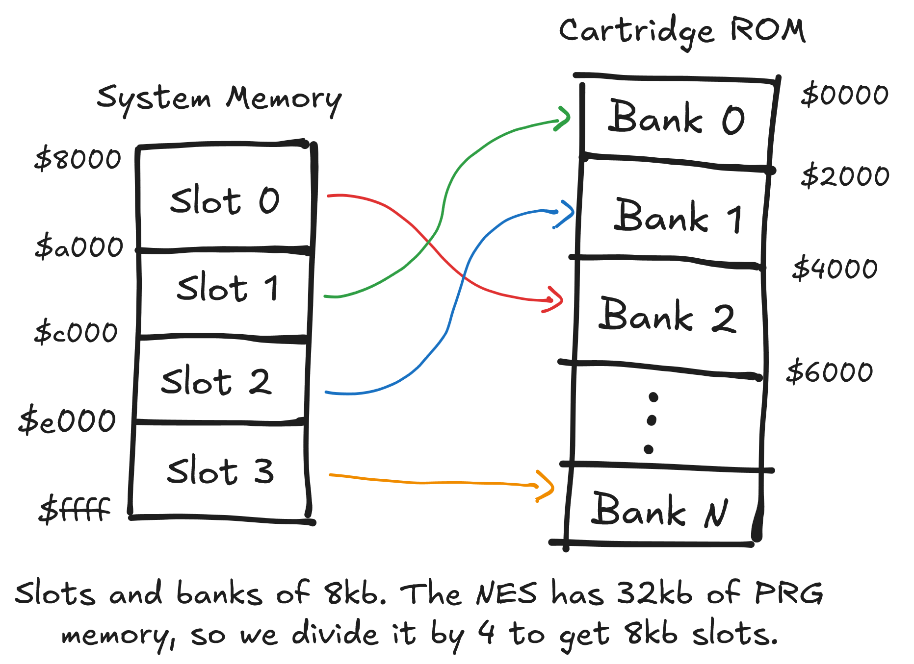

+++
date = '2025-02-10T22:29:48+01:00'
draft = false
description = 'Banking'
linkTitle = 'Banking system for NES/Gameboy emulators'
title = 'A bulletproof banking system for NES/Gameboy emulators'
summary = 'Guide on how to implement a powerful memory banking system for an emulator'
[params]
  author = 'Comba92'
tags = ['nes', 'emulation', 'coding']
keywords = ['nes', 'emulation', 'coding', 'banking', 'gameboy', 'implementation']
+++
Looking at nesdev's wiki about [mappers](https://www.nesdev.org/wiki/Mapper), can be daunting, knowing you will have to implement dozens of those to get more games working. Most people will either implement a few and call it a day with their NES emulation, and don't even bother trying with the hardest one.
<br>
It is true that to get most games running, you only need to implement the first 5 Nintendo mappers (NROM, MMC1, UxROM, CNROM, MMC3). Even if they only are 5, we have a lot of duplicate functionality.
For the Gameboy, banking works exactly the same as the NES, so we can use the same mechanism for both systems.

Mappers mostly have to do the same thing:
- Handle their registers writes to the PRG-ROM address range;
- Access to banked PRG/CHR addresses;
- Nametables mirroring (it is the same concept as PRG/CHR banking!)
- Other custom (and usually rare) functionality.

We surely do not want to implement each mapper logic from scratch. With this in mind, we can ease our mappers development with some good old abstraction.

## The Mapper interface
First, all mappers should provide a generic interface to work with them. They should store a banking object, which holds all the current game bankings configuration (PRG-ROM, CHR, PRG-RAM, and Nametables VRAM, yes, we also hold the PPU mirroring in there!)
The idea is this:
1. When we build the mapper, we set up the bankings.
2. When we WRITE to the registers to change banks, we update the banking configuration.
3. When we READ from the cartridge PRG-ROM, CHR, PRG-RAM, or from Nametables VRAM, we simply translate the address given the current banking configuration.
4. For more complex mappers, on each CPU clock, we can handle IRQs, Audio expansions, and scalines detectors (we might want to add other even functions based on how we need to wire the mapper object to the rest of our emulator).


  I have figured ALL mappers would need to hold the bankings object, i have decided to move it out to the memory management object, so that i only have to define it once, and then pass it to the mappers through its methods (this means less typing when defining mappers, probably).



  Rust shenanigans: as we can't know at compile which mapper to use, we are using a [trait object](https://doc.rust-lang.org/book/ch17-02-trait-objects.html), and we have to wrap it inside a [Box](https://doc.rust-lang.org/book/ch15-01-box.html) (heap allocated object), as it's size isn't known at compile time.


This is a sketch of how the mapper interface should be, and i provide some default implementations:

```rust
struct CartBaking {
  prg: Banking,
  chr: Banking,
  sram: Banking,  // PRG-RAM
  ciram: Banking, // Nametables VRAM
}

trait Mapper {
  // Here we set up the mapper registers, and most importantly the banking configuration.
  fn new(header: &CartHeader, banks: &mut CartBanking) -> Box<Self> where Self: Sized;

  // Here we handle the registers writes.
  fn prg_write(&mut self, banks: &mut CartBanking, addr: usize, val: u8);

  // These will dispatch the read to the correct target.
  fn map_cpu_addr(&mut self, banks: &mut CartBanking, addr: usize) -> CpuTarget {
    match addr {
      0x4020..=0x5FFF => CpuTarget::Cart,
      0x6000..=0x7FFF => CpuTarget::SRam(banks.sram.translate(addr)),
      0x8000..=0xFFFF => CpuTarget::Prg(banks.prg.translate(addr)),
      _ => unreachable!()
    }
  }

  fn map_ppu_addr(&mut self, banks: &mut CartBanking, addr: usize) -> PpuTarget {
    match addr {
      0x0000..=0x1FFF => PpuTarget::Chr(banks.chr.translate(addr)),
      0x2000..=0x2FFF => PpuTarget::CiRam(banks.ciram.translate(addr)),
      _ => unreachable!()
    }
  }

  // Mapper custom functionality, by default it does nothing.
  fn cpu_clock(&mut self) {}
}
```

Whenever we need more complex mapping logic (the infamous MMC5, for example), we just ovverride the default implementations. The new() and prg_write() methods always have to be implemented, of course.


## Implementing Banking
We now need a generic banking mechanism.
A mapper will have a varying amount of 'slots' or 'pages', which are the system's memory ranges, mapped to 'banks', which are cartridge's memory ranges.
A slot will be mapped to a bank depending on what was written to the slot select.
<br>
We will use a slots array, where each value is the configured bank for the specific slot.


```rust
// The hypothetic mapper in the image will configured like so.
let slots = [bank2, bank0, bank1, bankN]
```
When we get an address, we first have to fiure out in which slot we are:


$$SlotNumber = (Address - RangeStart) / SlotSize$$

We then get the bank starting address:


$$BankNumber = Slots[SlotNumber]$$
$$BankStartAddress = BankNumber*SlotSize$$

Notice how each bank starting address is a constant. Computing this each time we translate address can be saved work. So instead of saving the banks number, we save their starting address!

```rust
// We can save some computations by storing the banks starting address instead.
let slots = [bank2 * slotSize, bank0 * slotSize, bank1 * slotSize, bankN * slotSize]
```

Finally, we compute the final mapped address.


$$MappedAddress = BankStartAddress + (Address \bmod SlotSize)$$

Notice we wrap around the address by the slot size, so that we always get an address inside the bank. We then add this wrapped address to the bank number we got from the slot selection. 
The mapped address can now be used to address the full ROM range.


Be aware that divisions and modulos are slow, and we can do better.
They can be optimized for our dear computer friends by using bitwise operators.
Have a look at how [modulos](https://en.wikipedia.org/wiki/Modulo#Performance_issues) can be optimized here.
Can we do the same for the multiplication and division? Why?


### An example: MMC1's CHR banking
Let's take a mapper for our examples: the [MMC1](https://www.nesdev.org/wiki/MMC1) CHR banking.
The MMC1 has two modes for CHR banking. Let's look at mode1 first.

In this mode, there are two CHR slots. As the CHR address range is 8kb ($0 to $1000), each slot will be 4kb.

Whenever we write to CHR bank 0 ($C000 to $DFFF) or CHR bank 1 ($E000 to $FFFF), we will set the first slot to that bank number. 
```rust
// for $C000 to $DFFF
chr_banking.set_slot(0, value_written);

// for $E000 to $FFFF
chr_banks.set_slot(1, value_written);
```


Some games will write bigger banks numbers than the ones avaible in ROM. We must be sure to wrap the bank number around the biggest possible for that game.


Whenever we access CHR, we will get a mapped address to access the full CHR range.
```rust
let mapped_addr = chr_banks.tranlsate(address);
```

We basically don't have to think about mapping anymore: our abstraction is doing all the hard calculations for us!

Now, what for mode 0? Mode 0 will use a SINGLE CHR slot; this means it will be 8kb big. But our configuration is using 2. To deal with this change, we simply treat the 8kb slot as two 4kb slots. This will mean that whenever we write to the chr bank register in this mode, we have to set both slots. We can do something like this:

```rust
// MMC1 will cut the first bit of the bank number in this mode, so it is always expecting even bank numbers.
let bank = value_written & !1;
chr_banking.set_slot(0, value_written);
chr_banking.set_slot(1, value_written + 1)
```

In conclusion, when setting up the banks, we always set the slot size as the smallest possible slot size the mapper can have. When dealing with bigger slots, we update the relative slots as if they where still mapping to the smallest banks.
<br>
**We also have to be sure to update ALL slots whenever we change modes**. This is incredibly important, because the mode switch instantly changes how the bank selects behave. Mapper should provide an update_bankings() method, which updates all slots whenever a mode is changed.

Now, let's code the actual functions.

### The code: requirements
What we need:
- how big the ROM data is;
- how many slots the mapper provides;
- how big a slot is;
- the offset of the system memory range ($8000 for PRG-ROM, $2000 for Nametables, $6000 for PRG-RAM).

### The code: initialization
```rust
struct Banking {
  data_size: usize,
  bank_size: usize,
  banks_count: usize,
  slots_start: usize,
  slots: Vec<usize>,
}

impl Banking {
  pub fn new(
    rom_size: usize, 
    slots_start: usize, 
    slot_size: usize, 
    slots_count: usize
  ) -> Self {
    let slots = vec![0; slots_count].into_boxed_slice();
    let bank_size = slot_size;
    let banks_count = rom_size / bank_size;

    Self {
      data_size: rom_size, 
      slots, slots_start, bank_size, banks_count
    }
  }

  pub fn new_prg(header: &CartHeader, slots_count: usize) -> Self {
    let slot_size = 32*1024 / slots_count;
    Self::new(header.prg_size, 0x8000, slot_size, slots_count)
  }
}
```

  The methods new_chr(), new_sram(), and new_ciram() are left to the reader as an exercise :)



### The code: operations
We then provide these basic operations. Notice how set_slot saves the bank starting address, instead of the bank number. Also be sure to always wrap them around the maximum avaible count.

```rust
pub fn set_slot(&mut self, slot: usize, bank: usize) {
  // some games might write bigger bank numbers than really avaible
  let bank = (bank % self.banks_count);
  // i do not expect to write outside the slots array.
  self.slots[slot] = bank * self.bank_size;
}

// this can easily be generalized for any size.
pub fn set_slot2x(&mut self, slot: usize, bank: usize) {
  self.set_slot(slot*2, bank);
  self.set_slot(slot*2 + 1, bank + 1);
}

pub fn translate(&self, addr: usize) -> usize {
  // i do not expect to write outside the slots array here either. 
  // the bus object should take responsibilty to always pass correct addresses in range.
  let slot = (addr - self.slots_start) / self.bank_size;
  self.slots[slot] + (addr % self.bank_size)
}
```

  It would be incredibly convenient to have a method which configures a CIRAM banking given a Nametable mirroring. This is left as an exercise to the reader!


## A simple example: UxROM
We now have a very handy and convenient interface for developing mappers.
Look at how simple it is to fully implement UxROM:

```rust
struct UxROM;

impl Mapper for UxROM {
  fn new(header: &CartHeader, banks: &mut CartBanking)-> Box<Self> {
    // we have 2 bankable slots avaible for PRG, only 1 for CHR.
    banks.prg = Banking::new_prg(header, 2);
    banks.chr = Banking::new_chr(header, 1);
    // the CHR only slot should not be banked, so set it to the first (and only) CHR bank.
    banks.chr.set_slot(0, 0);
    Box::new(Self)
  }

  fn prg_write(&mut self, banks: &mut CartBanking, addr: usize, val: u8) {
    if (0x8000..=0xFFFF).contains(&addr) {
      let select = val & 0b1111;
      banks.prg.set_page(self.banked_page as usize, select as usize);
    }
  }
}
```
And that's it. It is now incredibly addicting to implement mappers. Have fun!

## Banking system use in my NES emulator
I have developed a NES emulator and roughly 30 mappers are working flawlessly with this system.
Have a look at it here: [my NES emulator](https://github.com/Comba92/nen-emulator).